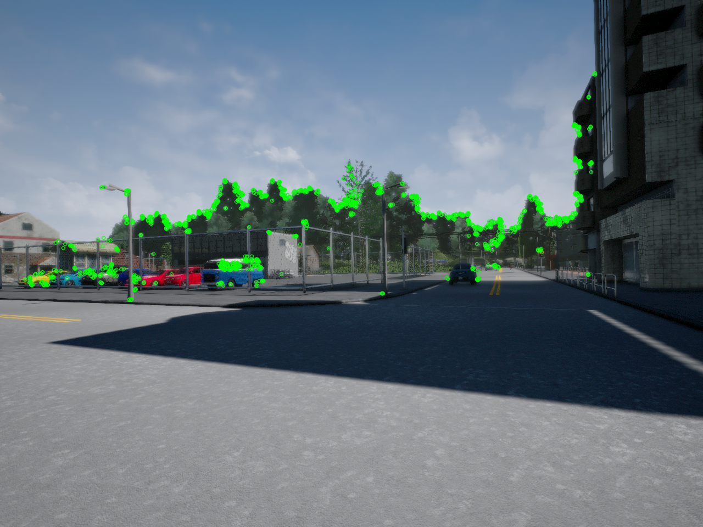

# Visual Odometry for Localization in Autonomous Driving

This project implements [visual odometry](https://en.wikipedia.org/wiki/Visual_odometry) to estimate the trajectory of a self-driving car.

**The steps of this project are the following:**

- Acquire an image and extract features using a feature detector.
- Find corresponding features in another image with feature matching.
- Determine the camera pose from the Perspective-n-Point solution using the RANSAC scheme.
- Build the vehicle trajectory from the camera pose estimation.

<p align="center">

</p>


## Table of Contents
- [Acknowledgements](#acknowledgements)
- [Dependencies](#dependencies)
- [Loading and Visualizing the Data](#loading-and-visualizing-the-data)
- [Feature Extraction](#feature-extraction)
- [Feature Matching](#feature-matching)
- [Trajectory Estimation](#trajectory-estimation)
  - [Estimating Camera Motion between a Pair of Images](#estimating-camera-motion-between-a-pair-of-images)
  - [Camera Trajectory Estimation](#camera-trajectory-estimation)
  - [Visualize Vehicle Trajectory](#visualize-vehicle-trajectory)

## Acknowledgements

This project is a programming assignment from the [Visual Perception for Self-Driving Cars](https://www.coursera.org/learn/visual-perception-self-driving-cars?) course. The [University of Toronto](https://www.utoronto.ca/) provided the starter code and the data from the [CARLA](https://carla.org/) simulator.

## Dependencies

The required Python packages are:

- numpy
- matplotlib
- opencv
- jupyter

You can also create the environment from the [environment.yml](./environment.yml) file

```bash
conda env create -f environment.yml
```


## Loading and Visualizing the Data

The starter code provides a convenient dataset handler class to read and iterate through samples taken from the [CARLA](https://carla.org/) simulator.

```python
dataset_handler = DatasetHandler()
```

The dataset handler contains 52 data frames. Each frame contains an RGB image and a depth map taken with a setup on the vehicle and a grayscale version of the RGB image which will be used for computation. Furthermore, the camera calibration matrix `K` is also provided in the dataset handler.

Upon creation of the dataset handler object, all the frames will be automatically read and loaded. The frame content can be accessed by using `images`, `images_rgb`, `depth_maps` attributes of the dataset handler object along with the index of the requested frame.

Here is an example of the grayscale images:

<p align="center">

</p>

Here is an example of the RGB images:

<p align="center">

</p>

Here is an example of the depth maps:

<p align="center">

</p>


**Notes about Depth Maps**

The maximum depth distance is 1000. This value of depth shows that the selected pixel is at least 1000m (1km) far from the camera however, the exact distance of this pixel from the camera is unknown. Having these points in further trajectory estimation might affect precision.

## Feature Extraction

The purpose of this section is to implement a function to extract features from an image. A **feature** is a point of interest in an image defined by its image pixel coordinates. A **descriptor** is an n-dimensional vector that summarizes the image information around the detected feature. The following figure illustrates these properties.

<p align="center">

</p>
<p align="center">
    <b>Source:</b> <a href="https://www.coursera.org/learn/visual-perception-self-driving-cars/lecture/CYWEj/lesson-2-feature-descriptors" target="_blank">Lesson 2: Feature Descriptors</a>
</p>
Here is a list of common feature detectors:

- Scale-Invariant Feature Transform (**SIFT**)
- Speeded-Up Robust Features (**SURF**)
- Features from Accelerated Segment Test (**FAST**)
- Binary Robust Independent Elementary Features (**BRIEF**)
- Oriented FAST and Rotated BRIEF (**ORB**)

The OpenCV documentation provides implementation [examples](https://docs.opencv.org/3.4.3/db/d27/tutorial_py_table_of_contents_feature2d.html) of these detectors.

This section of code shows the implementation of the `extract_features` function.

```python
# Initiate ORB detector
orb = cv2.ORB_create(nfeatures=1500)

# Find the keypoints and descriptors with ORB
kp, des = orb.detectAndCompute(image, None)
```

Here is an example of the extracted features:

<p align="center">

</p>

## Feature Matching

The purpose of this section is to implement a function to match features in a sequence of images. **Feature matching** is the process of establishing correspondences between two images of the same scene.

<p align="center">

</p>
<p align="center">
    <b>Source:</b> <a href="https://www.coursera.org/learn/visual-perception-self-driving-cars/lecture/YLRTR/lesson-3-part-1-feature-matching" target="_blank">Lesson 3: Feature Matching</a>
</p>

OpenCV provides two techniques to match different descriptors: Brute-Force matcher and FLANN based matcher.

The **Brute-Force** matcher compares one descriptor in the first image to all descriptors in the second image. The algorithm then matches the descriptor with the shortest distance to the descriptor in the first image.

**FLANN** stands for Fast Library for Approximate Nearest Neighbors. It contains a collection of algorithms optimized for fast neighbor search in datasets and high dimensional features.

This section of code shows the implementation of the `match_features` function.

```python
# Define FLANN parameters
FLANN_INDEX_LSH = 6
index_params = dict(algorithm = FLANN_INDEX_LSH,
                    table_number = 6,
                    key_size = 12,
                    multi_probe_level = 1)
search_params = dict(checks = 50)

# Initiate FLANN matcher
flann = cv2.FlannBasedMatcher(index_params, search_params)

# Find matches with FLANN
match = flann.knnMatch(des1, des2, k=2)
```

Here is an example of the matched features:

<p align="center">

</p>

## Trajectory Estimation

The purpose of this section is to develop a function to determine the pose of the self-driving car. **Visual odometry** is a method to estimate the pose by examining the changes that motion induces in the onboard camera.

Previously, we extracted features `f[k - 1]` and `f[k]` from two consecutive frames `I[k - 1]` and `I[k]`. We can use these features to estimate the camera motion from 3D-2D point correspondences. In other words, we need to find a joint rotation-translation matrix `[R|t]` such that features `f[k - 1]` expressed in 3D world coordinates correspond to features `f[k]` in 2D image coordinates.

Here is a slide that summarizes the motion estimation problem

<p align="center">

</p>
<p align="center">
    <b>Source:</b> <a href="https://www.coursera.org/learn/visual-perception-self-driving-cars/lecture/Zq8NO/lesson-5-visual-odometry" target="_blank">Lesson 5: Visual Odometry</a>
</p>

### Estimating Camera Motion between a Pair of Images

One way we can solve for the rotation and translation is by using the *Perspective-n-Point (PnP)* algorithm.

This algorithm has three steps.

- Solve for the initial guess of `[R|t]` using [Direct Linear Transform (DLT)](https://en.wikipedia.org/wiki/Direct_linear_transformation).
- Improve the solution using the [Levenberg-Marquardt algorithm (LM)](https://en.wikipedia.org/wiki/Levenberg%E2%80%93Marquardt_algorithm).
- Use [random sampling consensus (RANSAC)](https://en.wikipedia.org/wiki/Random_sample_consensus) to handle outliers.

Fortunately, OpenCV has a robust implementation of the PnP algorithm in `cv2.solvePnP()` and `cv2.solvePnPRansac()`. These functions take three arguments.

- *objectPoints* a numpy array of object points in camera coordinates (3D).
- *imagePoints* a numpy array of corresponding image points (2D).
- *cameraMatrix* the input camera intrinsic matrix K.

We then need to express pixels from features `f[k - 1]` in camera coordinates to get *objectPoints*. This coordinate transformation derives from the pinhole camera model and is given by the equation.

<p align="center">

</p>

This section of code shows the implementation of the `camera_motion` function.

```python
# Iterate through the matched features
for m in match:
    # Get the pixel coordinates of features f[k - 1] and f[k]
    u1, v1 = kp1[m.queryIdx].pt
    u2, v2 = kp2[m.trainIdx].pt
    
    # Get the scale of features f[k - 1] from the depth map
    s = depth1[int(v1), int(u1)]
    
    # Check for valid scale values
    if s < 1000:
        # Transform pixel coordinates to camera coordinates using the pinhole camera model
        p_c = np.linalg.inv(k) @ (s * np.array([u1, v1, 1]))
        
        # Save the results
        image1_points.append([u1, v1])
        image2_points.append([u2, v2])
        objectpoints.append(p_c)
    
# Convert lists to numpy arrays
objectpoints = np.vstack(objectpoints)
imagepoints = np.array(image2_points)

# Determine the camera pose from the Perspective-n-Point solution using the RANSAC scheme
_, rvec, tvec, _ = cv2.solvePnPRansac(objectpoints, imagepoints, k, None)

# Convert rotation vector to rotation matrix
rmat, _ = cv2.Rodrigues(rvec)
```

The *Detailed Description* section of [OpenCV: Camera Calibration and 3D Reconstruction](https://docs.opencv.org/3.4.3/d9/d0c/group__calib3d.html) explains the connection between the 3D world coordinate system and the 2D image coordinate system.

### Camera Trajectory Estimation

Finally, we build the vehicle trajectory by considering the camera pose change in each subsequent image.

It is important to note that the `estimate_motion` function returns the rotation and translation from the world coordinate system to the camera coordinate system (see [cv2.solvePnP](https://docs.opencv.org/3.4.3/d9/d0c/group__calib3d.html#ga549c2075fac14829ff4a58bc931c033d)).

<p align="center">

</p>


We, therefore, need to use the inverse to express the trajectory in the world coordinate system.

<p align="center">

</p>

This section of code shows the implementation of the `estimate_trajectory` function.

```python
# Create variables for computation
trajectory = np.zeros((3, len(matches) + 1))
robot_pose = np.zeros((len(matches) + 1, 4, 4))

# Initialize camera pose
robot_pose[0] = np.eye(4)

# Iterate through the matched features
for i in range(len(matches)):
    # Estimate camera motion between a pair of images
    rmat, tvec, image1_points, image2_points = estimate_motion(matches[i], kp_list[i], kp_list[i + 1], k, depth_maps[i])
    
    # Save camera movement visualization
    if save:
        image = visualize_camera_movement(dataset_handler.images_rgb[i], image1_points, dataset_handler.images_rgb[i + 1], image2_points)
        plt.imsave('{}/frame_{:02d}.jpg'.format(save, i), image)
    
    # Determine current pose from rotation and translation matrices
    current_pose = np.eye(4)
    current_pose[0:3, 0:3] = rmat
    current_pose[0:3, 3] = tvec.T
    
    # Build the robot's pose from the initial position by multiplying previous and current poses
    robot_pose[i + 1] = robot_pose[i] @ np.linalg.inv(current_pose)
    
    # Calculate current camera position from origin
    position = robot_pose[i + 1] @ np.array([0., 0., 0., 1.])
    
    # Build trajectory
    trajectory[:, i + 1] = position[0:3]
```

### Visualize Vehicle Trajectory

Here is the estimated vehicle trajectory:

<p align="center">

</p>